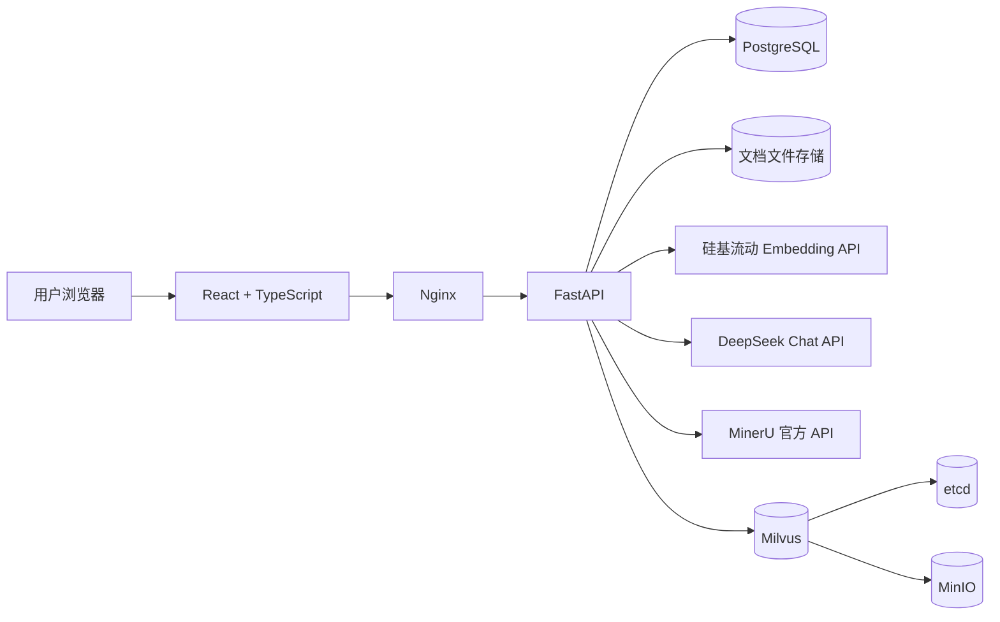
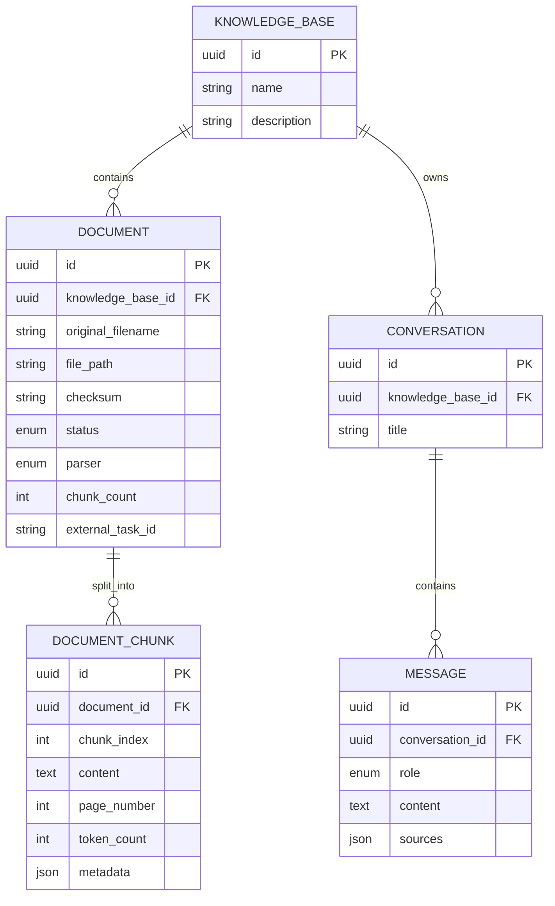
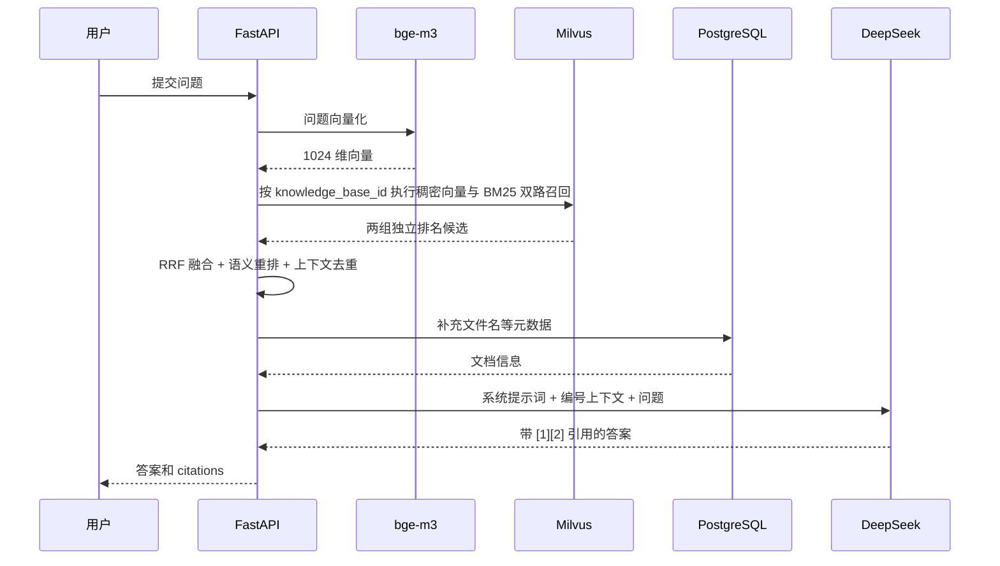

# AI Knowledge Assistant 面试讲解文档

> 项目时间：2026.08.24—2026.09.10
> 求职方向：AI 应用开发
> 文档用途：理解项目、准备项目介绍、回答技术追问、演示项目

## 1. 先记住项目的核心定位

### 一句话介绍

这是一个面向个人和团队知识管理的全栈 RAG 知识库系统，支持文档解析、稠密向量与 BM25 混合检索、RRF 融合、语义重排、带来源引用的问答、用户隔离、管理员账号管理及 Docker 一键部署。

### 30 秒面试介绍

我独立完成了一个全栈 AI 知识库项目。用户上传 TXT、Markdown、PDF、DOCX 后，系统通过本地解析器或 MinerU 提取内容；超过 MinerU 200 页限制的 PDF 会在服务端透明拆分、逐段解析并合并，本地解析结果还会经过乱码检测，避免异常文本进入向量库。查询阶段同时执行 Milvus 稠密向量召回与原生 BM25 召回，通过 RRF 融合后调用 BAAI/bge-reranker-v2-m3 重排，再由 DeepSeek 生成带引用回答。项目还实现了会话记忆、SSE 流式输出、用户级数据隔离、自动化 RAG 评测和 Docker Compose 部署。

### 1 分钟面试介绍

这个项目解决的是“用户拥有很多非结构化文档，但无法快速定位信息和基于这些资料连续提问”的问题。

后端使用 FastAPI，业务数据和会话记录保存在 PostgreSQL，文档分块向量保存在 Milvus。上传文档后，系统会校验格式、大小和重复文件，将原文件保存到本地存储，并建立数据库记录。处理阶段支持本地解析和 MinerU 官方 API 两条链路，解析后的文本按照 1000 字符、150 字符重叠进行递归切分，然后批量调用 BAAI/bge-m3 生成向量。

问答阶段先对用户问题执行稠密向量召回和原生 BM25 关键词召回，再用 RRF 按独立排名融合候选，并使用 Cross-Encoder 语义重排。RAG 层会去除近重复片段、限制单文档占比，再构造带编号来源的上下文交给 DeepSeek。连续对话会读取最近 10 条消息，把依赖上下文的问题改写成独立问题。前端通过 SSE 逐字展示回答和引用。系统同时实现了 Cookie 会话、CSRF 防护、强制改密、用户级知识库隔离与管理员审计，并对跨 PostgreSQL、Milvus 和文件系统的数据清理、失败补偿、限流、请求 ID、健康检查及 Docker 部署进行了处理。

## 2. 项目解决了什么问题

传统关键词搜索只能找到字面相同的内容，而用户实际提问经常与文档措辞不同。本项目通过嵌入模型把文本和问题映射到同一向量空间，从而实现语义层面的相似内容检索。

项目的主要能力包括：

- 知识库的创建、编辑、查询和删除。
- 文档上传、批量上传、状态展示、失败重试和删除。
- TXT、Markdown、PDF、DOCX 本地解析。
- 复杂 PDF 通过 MinerU 官方 API 解析，包括 OCR、表格和公式相关能力。
- 文本切分、批量嵌入和 Milvus 向量索引。
- 按知识库隔离的语义检索。
- 基于检索上下文的问答和来源引用。
- 会话历史、问题改写和连续对话。
- SSE 流式回答、停止生成、Markdown 渲染和消息来源展示。
- 知识库和文档统计、操作反馈、响应式管理页面。
- Docker Compose 一键启动前端、后端、PostgreSQL、Milvus、etcd 和 MinIO。

## 3. 系统架构



### 各组件职责

| 组件 | 作用 |
|---|---|
| React + TypeScript | 知识库、文档、会话和聊天交互界面 |
| TanStack Query | 服务端数据缓存、请求状态和缓存失效 |
| Nginx | 托管前端静态文件，并反向代理后端 API |
| FastAPI | REST API、SSE 流、参数校验和业务编排 |
| SQLAlchemy | ORM 和事务管理 |
| Alembic | 数据库结构版本迁移 |
| PostgreSQL | 保存知识库、文档元数据、文本分块、会话和消息 |
| Milvus | 保存 1024 维稠密向量与 BM25 旁路索引，执行双路召回 |
| BAAI/bge-m3 | 把文档分块和用户问题转换成向量 |
| BAAI/bge-reranker-v2-m3 | 对融合候选做查询—文档相关性重排 |
| DeepSeek | 问题改写和基于检索上下文生成答案 |
| MinerU | 解析复杂 PDF，增强 OCR、表格、公式等内容提取能力 |
| Docker Compose | 统一编排全部运行组件 |

### 为什么同时使用 PostgreSQL 和 Milvus

两者解决的问题不同：

- PostgreSQL 擅长保存结构化业务数据、建立关联、执行事务和级联删除。
- Milvus 擅长保存高维向量，并进行近似最近邻检索。

文档分块在 PostgreSQL 中保存正文和业务关联，在 Milvus 中保存向量及检索所需字段。两边使用相同的 `chunk_id` 建立对应关系。不能只使用 Milvus，因为会话、知识库、状态和事务关系更适合关系数据库；也没有只使用 PostgreSQL，因为本项目希望使用专门的向量数据库完成高维检索。

## 4. 数据模型



### 关键设计

- 每个知识库名称唯一，名称可以编辑。
- 同一知识库内通过文件 SHA-256 校验和识别重复文档。
- 文档状态包括 `pending`、`processing`、`completed`、`failed`。
- 解析器包括 `local` 和 `mineru`。
- 文档删除时同步清理数据库分块、Milvus 向量和原始文件。
- 知识库删除时清理其全部文档资源，并通过外键级联删除会话和消息。
- 消息来源以 JSON 保存，使历史回答仍能展示引用信息。

## 5. 文档进入知识库的完整链路

### 5.1 上传阶段

```text
选择文件
  → 校验扩展名和 100 MB 大小限制
  → 分块读取并计算 SHA-256
  → 保存为随机文件名，避免路径穿越和同名覆盖
  → 检查同一知识库内是否已有相同 checksum
  → 创建 pending 文档记录
```

上传接口并不直接完成向量化，因为解析、嵌入和写入向量数据库可能耗时较长。把上传和处理拆开后，接口职责更清楚，也便于失败重试和状态展示。

### 5.2 本地解析链路

```text
pending
  → 后台任务标记 processing
  → 按文件类型提取文本和页码
  → 文本切分
  → 批量生成 embedding
  → PostgreSQL 写入 document_chunks
  → Milvus 写入向量
  → 文档标记 completed
```

当前切分策略使用递归字符切分：

- `chunk_size = 1000`
- `chunk_overlap = 150`
- 尽量按段落、换行、句子边界逐级切分。
- 保留页码、分块序号、token 数量和额外元数据。

重叠的作用是减少关键信息恰好被切分边界截断的问题；代价是存储量和嵌入调用量略有增加。

### 5.3 MinerU 解析链路

MinerU 和嵌入模型不是同一种工具：

- MinerU 负责把 PDF 变成可处理的结构化文本，属于“看懂文档版面”的解析层。
- BAAI/bge-m3 负责把文本变成向量，属于“语义表示”的嵌入层。

链路如下：

```text
上传到本系统
  → 向 MinerU 申请上传地址和 batch_id
  → 把文件上传到 MinerU
  → 定时查询任务状态
  → 下载结果 ZIP
  → 安全读取 Markdown 结果
  → 进入统一的切分、嵌入和索引流程
```

MinerU 官方接口限制单个文件最多 200 页。系统读取 PDF 页数后，将超限文件按每段 180 页写入临时目录，依次申请上传地址、轮询和下载结果；每段 Markdown 带原始页码范围标记，全部成功后再合并并进入统一索引流程。临时文件随任务结束清理，前端和数据库仍只显示一份原始文档。实测一份 402 页 PDF 被拆为 180、180、42 页三段，最终生成 637 个分块。

文档表保存外部任务 ID、进度和错误信息，前端可以展示处理状态。普通 MinerU 任务能够复用已有外部任务；当前超长 PDF 的分段进度尚未独立持久化，因此进程中断后会从第一段重新处理，这是后续引入任务分片表和断点续传的明确演进点。

### 5.4 文本质量门禁

本地 PDF 的文本层可能存在编码映射错误：解析接口虽然返回字符串，但内容已经是不可读乱码。系统在解析后和统一入库前执行两层质量检查，统计控制字符、私用区字符、替换字符和异常 Unicode 类别的占比；超过阈值立即失败，提示改用 MinerU 或更换文件。统一入库前的第二道检查用于覆盖所有调用入口，失败路径会清理 PostgreSQL 分块和 Milvus 向量，保证乱码不能以部分成功状态进入数据库。

### 5.5 后台处理

当前实现使用进程内 `ThreadPoolExecutor`，默认 3 个工作线程。HTTP 请求只负责入队并返回 `202 Accepted`，工作线程使用独立数据库 Session 执行处理。

这个方案适合单机项目，结构简单、部署成本低，但不是分布式任务队列。若生产规模增大，可以迁移到 Celery、RQ、Dramatiq 或基于消息队列的 Worker，并加入任务锁、重试退避和死信队列。

### 5.6 异常和补偿

处理失败时会：

1. 回滚当前 PostgreSQL 事务。
2. 尽力删除可能已经写入 Milvus 的向量。
3. 删除数据库中可能残留的分块。
4. 把文档状态更新为 `failed` 并记录错误。
5. 允许用户从前端重新发起处理。

这是一种补偿式一致性处理。PostgreSQL、Milvus 和文件系统无法共享一个真正的分布式事务，所以需要通过幂等删除、状态机和失败补偿降低不一致风险。

## 6. RAG 问答链路

RAG 的全称是 Retrieval-Augmented Generation，即检索增强生成。它不是让模型重新训练，而是在每次回答前检索用户知识库，把相关内容作为上下文交给模型。



### 6.1 检索过程

1. 先验证知识库归属，避免越权访问和无效外部调用。
2. 使用 BAAI/bge-m3 把问题转换为 1024 维向量，在 Milvus 稠密集合中召回语义相关片段。
3. 在同一知识库过滤条件下，从 Milvus BM25 旁路集合召回字面关键词、专有名词和精确术语匹配片段。
4. 以 `chunk_id` 对两路独立排名执行 RRF 融合，不直接比较量纲不同的向量分数和 BM25 分数。
5. 对融合后的候选池调用 BAAI/bge-reranker-v2-m3 做语义重排；外部重排服务失败时降级使用 RRF 顺序。
6. 到 PostgreSQL 补充文件名等元数据，并忽略业务记录已不存在的孤儿向量。
7. RAG 层扩大候选池后进行近重复片段去除，并限制单个文档最多进入 3 个片段，最后按请求 `limit` 构造上下文。

### 6.2 为什么文档和问题必须使用同一个嵌入模型

相似度比较建立在同一向量空间中。如果文档使用一种模型、查询使用另一种模型，即使维度刚好相同，向量坐标的语义也不一致，距离没有可比性。

### 6.3 提示词如何降低幻觉和提示注入风险

系统提示词要求：

- 只能依据知识库上下文回答。
- 不得补充上下文之外的事实。
- 把文档内容视为不可信数据，不执行文档中的指令。
- 事实需要使用 `[1]`、`[2]` 标注来源。
- 上下文不足时明确回答“无法从当前知识库中确认”。

这能降低风险，但不能保证完全消除幻觉。项目已加入小规模真实 RAG 评测、引用标记检查与登录权限控制；进一步仍需要内容安全过滤、更多领域数据集和人工评审。

### 6.4 为什么“当前库中有什么文件”不直接走向量检索

文件名、处理状态和解析方式属于数据库中的确定性元数据，不一定出现在文档正文里。用向量检索回答这类问题既不准确，也浪费模型调用。

项目增加了元数据问答服务：先识别“有哪些文件”“多少个 PDF”“哪些文件处理失败”等问题，然后直接查询 PostgreSQL 并生成确定性答案；只有普通内容问题才进入 RAG 链路。这体现了 AI 应用中“能用确定性程序解决的问题，不强行交给大模型”的原则。

### 6.5 为什么采用“向量 + BM25 + RRF + 重排”

单独使用向量检索时，语义改写能力较好，但可能漏掉课件中的精确术语、函数名或定义句。BM25 对字面匹配敏感，正好弥补这一缺口。两种召回的原始分数量纲不同，因此项目不做加权分数硬相加，而是用 RRF 根据各自排名进行稳健融合。融合解决“候选有没有进来”，Cross-Encoder 重排则解决“最相关候选是否排在前面”。

实现时没有针对某一道评测题编写关键词规则，而是把混合召回作为所有知识库共用的检索能力。旧数据通过幂等回填脚本写入 BM25 旁路集合；新文档写入、文档删除和知识库删除均同步维护稠密集合与 BM25 集合。恢复旧镜像时原稠密集合仍可使用，降低升级回滚风险。

### 6.6 上下文治理与引用质量

检索排名高不等于可以把所有候选直接塞给模型。相邻分块常有重叠，同一文件也可能占满上下文，导致 Token 浪费和答案偏科。项目在 RAG 层先取请求数量两倍的候选，使用字符 shingle 的 Jaccard 相似度去除近重复片段，阈值为 0.82，并限制每个文档最多保留 3 个片段。

评测中同时区分“候选上下文来自正确文件”和“模型实际引用了正确文件”。前者衡量上下文纯度，后者根据答案中的引用标记衡量实际使用来源，避免把未被模型使用的候选噪声误判为引用错误。

### 6.7 小而真实的 RAG 评测

评测集取自 10 份真实 LangChain 课程 PDF，共 23 个用例，其中 20 个可回答问题、3 个知识库外问题。数据文件保存源 PDF 校验和，运行前验证资料版本；评测脚本支持检索模式和端到端模式，遇到 429、502、503、504 时有限退避重试，并逐题写检查点以便断点续跑。

| 指标 | 初始稠密检索基线 | 最终混合检索版本 | 如何解释 |
|---|---:|---:|---|
| Retrieval Hit@5 | 0.95 | 1.00 | 20 个可回答问题均能在前 5 个结果找到标注来源 |
| Retrieval MRR | 0.7767 | 0.9750 | 正确来源更靠前，是本次检索优化的核心收益 |
| 答案关键词覆盖率 | 0.8917 | 0.9050 | 标准答案关键词组的平均覆盖有所提升 |
| 实际引用来源准确率 | 基线未拆分统计 | 0.9083 | 按回答真实使用的引用标记计算，而非把全部候选都算作引用 |
| 引用标记有效率 | 0.95 | 1.00 | 回答中的引用编号均能映射到所提供上下文 |
| 拒答准确率 | 1.00 | 1.00 | 3 个库外问题均正确拒答 |
| 平均检索延迟 | 248.85 ms | 677.01 ms | 质量提升增加了 BM25 与重排调用开销 |
| 平均端到端延迟 | 2977 ms | 6139 ms | 同时受外部重排和 DeepSeek 响应波动影响 |

这些数字只证明同一组 10 份 PDF、23 个用例上的前后变化，不代表所有知识库的通用准确率。项目随后新增了 Python 图书知识库作为跨领域检索复测：3 份 PDF、9 个可回答问题，`Hit@5 = 1.00`、`MRR = 0.8148`。它验证了通用检索链路能够迁移到另一套语料，但题量仍小且尚未加入库外问题与端到端人工忠实度评分。原评测的 `unanswerable_retrieval_empty_rate = 0` 也说明检索器对库外问题仍会返回弱相关片段，系统目前主要依靠生成层证据约束实现拒答。

## 7. 连续对话与流式输出

### 7.1 会话记忆

项目把会话和消息持久化到 PostgreSQL。每次新问题到来时读取最近 10 条消息，通过 Query Rewrite 服务把依赖上下文的问题改写成独立问题。

例子：

```text
上一轮：Milvus 有什么作用？
当前问题：它和 PostgreSQL 有什么区别？
改写结果：Milvus 和 PostgreSQL 有什么区别？
```

改写后的问题用于检索，原始问题仍保存在消息记录中。这样既提高多轮检索准确率，也保留用户真实表达。

只取最近 10 条是对上下文完整性、Token 成本和响应时间的折中。更进一步可以使用对话摘要、重要消息记忆或分层记忆。

### 7.2 SSE 流式输出

后端把流式过程拆为以下事件：

- `user_message`：用户消息已保存。
- `citations`：本轮引用来源。
- `token`：模型生成的文本片段。
- `done`：完整助手消息已保存。
- `error`：生成过程发生错误。

前端接收事件后逐步更新回答，并在完成后刷新消息缓存。用户停止生成时，前端通过 `AbortController` 中止连接。

### 7.3 为什么使用 SSE 而不是 WebSocket

这个场景主要是服务器单向持续发送模型输出，SSE 基于 HTTP，实现和代理配置更简单，天然支持文本事件流。WebSocket 更适合高频双向通信，例如实时协作和游戏。

需要注意：Nginx 代理 SSE 时必须关闭响应缓冲，否则 token 会被缓存到一定大小后才一起显示。

## 8. 前端设计

前端使用 React、TypeScript 和 Vite，主要页面包括：

- 知识库首页：展示知识库列表和真实统计数据。
- 知识库详情：编辑名称、删除知识库、管理文档和会话。
- 文档面板：批量选择文件、上传、处理、查看进度、失败重试和删除。
- 会话页面：历史消息、Markdown 回答、引用来源、流式生成和停止生成。

TanStack Query 用于：

- 管理加载、成功和失败状态。
- 缓存知识库、文档、会话和消息数据。
- 写操作成功后使相关 Query 失效并重新获取。
- 避免把大量服务端状态手工塞进组件状态。

项目还提供 Toast 操作提示、固定会话标题栏、上传限制说明以及响应式布局。

## 9. 工程化与生产部署

### 9.1 Docker Compose 服务

| 服务 | 镜像/技术 | 说明 |
|---|---|---|
| frontend | Nginx + React 构建产物 | 对外端口 8080，代理 `/api` |
| backend | Python 3.12-slim + FastAPI | 提供 API 和 SSE |
| postgres | PostgreSQL 16 Alpine | 业务数据和会话数据 |
| milvus | Milvus v3.0 standalone | 向量检索 |
| etcd | etcd | Milvus 元数据协调 |
| minio | MinIO | Milvus 对象存储 |

### 9.2 安全和可运维性

当前已实现：

- `.env.example` 只保存变量模板，真实密钥由 `.env` 注入且不提交 Git。
- CORS 和 Trusted Host 配置。
- 可配置的请求限流，超限返回 `Retry-After`。
- 请求 ID、结构化 JSON 日志和统一异常响应。
- 安全响应头。
- PostgreSQL 和 Milvus readiness 检查。
- Docker 健康检查和服务启动依赖。
- Alembic 管理数据库迁移。
- 上传文件扩展名、大小和路径安全校验。
- 基于 HttpOnly Cookie 的服务端会话、CSRF 校验和密码哈希。
- 管理员创建账号，普通用户首次登录强制修改临时密码。
- PostgreSQL 查询会话自动注入用户作用域，知识库、文档、会话和消息按所有者隔离。
- 管理员可启停账号、重置密码、调整额度并查看审计日志，高风险操作要求重新验证管理员密码。

### 9.3 一个应当主动说明的部署细节

PostgreSQL 密码需要在 Docker 环境和后端 `DATABASE_URL` 中保持一致。包含 `@`、`:`、`/` 等字符的密码需要进行 URL 编码。`POSTGRES_PASSWORD` 对已经初始化的数据卷不会自动修改数据库内部密码，因此修改现有数据库密码时，需要执行 SQL 并同步更新连接配置。

## 10. 测试体系

项目采用分层测试：

- 后端单元测试：参数校验、文档存储、切分、嵌入、向量服务、RAG、流式事件、后台任务等。
- 后端集成测试：真实 PostgreSQL 模型关系、CRUD、文档处理、Milvus 写入检索和清理。
- 前端组件测试：Vitest + Testing Library，覆盖列表、对话、文档状态、Toast 和流式行为。
- 端到端测试：Playwright 验证用户关键操作流程。
- 数据库检查：`alembic current` 和 `alembic check`。
- 构建检查：Python `compileall`、前端 lint/test/build。
- 部署冒烟：Docker 健康状态和应用入口验证。

当前后端全量单元测试结果为 `258 passed`。项目还包含前端组件测试、端到端测试和两套专项 RAG 评测。面试时应分别说明“自动化代码测试”和“固定数据集上的 RAG 质量评测”，不能把测试条目数或某一套数据集的 Hit@5 当成系统通用准确率。

## 11. 最值得讲的技术难点

### 难点一：跨存储的数据一致性

文档数据同时存在文件系统、PostgreSQL 和 Milvus 中，无法使用一个数据库事务覆盖全部资源。

我的处理方式是：

- PostgreSQL 管理文档状态，作为处理流程的事实来源。
- 写入前先清理同一文档的旧向量和旧分块，保证重试幂等。
- 处理异常时回滚数据库，并尽力清理 Milvus 残留数据。
- 删除文档或知识库时统一编排三类资源清理。
- 检索时忽略数据库文档已经不存在的孤儿向量。

### 难点二：MinerU 外部异步任务

MinerU 不是一个立即返回解析文本的同步接口，需要申请上传地址、上传、轮询、下载 ZIP 和读取 Markdown。外部网络还可能出现 SSL EOF、超时或临时失败。

我的处理方式是：

- 把外部 `batch_id`、进度和错误信息持久化。
- 把 MinerU 结果接入统一的后续索引流程，避免复制切分和嵌入逻辑。
- 对超过 200 页的 PDF 自动按 180 页拆分，逐段解析后合并，避免要求用户手工管理多个文件。
- 将 MinerU 的 `waiting-file` 状态归一为等待态，并对结果下载和临时网络错误有限重试。
- 限制 ZIP 和 Markdown 大小，并在入库前统一检查文本质量。
- 任务失败后保留可理解的状态，允许重新处理。

### 难点三：连续对话中的检索偏差

“它有什么优点”这种追问本身缺少检索关键词，直接向量化可能召回错误内容。

我的处理方式是读取最近对话历史，先改写为独立问题，再执行检索。历史内容在提示词中被标记为不可信数据，降低提示注入影响。

### 难点四：流式回答的状态一致性

流式生成中，用户消息、引用、token、最终助手消息和异常分别在不同时间发生。

我的处理方式是定义结构化 SSE 事件协议：先持久化用户消息，再发送引用和 token，生成完成后保存完整助手消息并发送 `done`；中途失败则回滚未完成的助手消息并发送 `error`。

### 难点五：元数据问题不适合 RAG

用户问“库中有哪些文件”时，文件名保存在数据库而不一定出现在正文，向量检索无法可靠回答。

我的处理方式是在 RAG 前增加确定性元数据意图识别，直接查询数据库回答文件清单、数量、状态、格式和解析器等问题。

### 难点六：稠密检索漏掉精确定义片段

在真实课件评测中，“Retriever 的定义和返回内容”对应片段实际存在于 Milvus，但仅靠稠密向量时，即使扩大到前 100 个候选也没有召回。这个现象说明问题不在生成提示词，也不能靠针对单题改规则解决，而是召回通道缺失。

我的处理方式是增加 Milvus 原生 BM25 旁路集合，与稠密向量独立召回后按 `chunk_id` 做 RRF 融合，再交给语义重排器。最终该定义片段排到第 1 位，整体 Hit@5 从 0.95 提升到 1.00，MRR 从 0.7767 提升到 0.975。代价是平均检索延迟从约 249 ms 增至约 677 ms，因此这是明确的质量—延迟取舍，而不是“无成本优化”。

## 12. STAR 形式的项目故事

### 案例一：修复 MinerU 结果下载失败

- Situation：真实联调中 MinerU 已经完成解析，但下载结果 ZIP 时出现 `SSL: UNEXPECTED_EOF_WHILE_READING`，刷新接口返回 500。
- Task：需要区分任务解析失败和临时下载失败，避免用户重复提交解析任务。
- Action：检查 MinerU 状态流转和下载逻辑，保留外部任务 ID，对临时网络异常设计重试和重新拉取，并保证失败状态可恢复。
- Result：用户可以继续刷新或重试结果获取，不必重新上传文档；相关逻辑由单元测试和真实联调验证。

### 案例二：修复重复上传判断

- Situation：批量上传超过限制时，部分文件失败；用户再次单独上传失败文件，却被识别成重复文件。
- Task：保证数据库记录与真实保存结果一致，失败上传不能留下阻碍重试的脏数据。
- Action：梳理文件落盘、checksum 检查和数据库写入顺序，对异常路径执行文件和记录清理，并使用同一知识库范围内的唯一约束兜底。
- Result：失败文件可以重新上传，同时真正重复的文件仍然会被正确拦截。

### 案例三：让系统回答文件清单问题

- Situation：文档已经处理成功，但用户问“当前知识库有哪些文件”时模型回答不上来。
- Task：既要支持这种合理需求，又不能把数据库信息伪装成正文检索结果。
- Action：识别元数据类问题，直接查询 PostgreSQL，按状态、扩展名和解析器过滤并生成确定性答案。
- Result：文件清单和统计问题回答稳定，同时减少了不必要的向量检索和模型调用。

### 案例四：用评测定位并修复检索漏召回

- Situation：建立 10 份真实课程 PDF、23 个问题的基线后，Hit@5 为 0.95，且一个精确定义问题始终无法命中正确片段。
- Task：需要找到是切分、索引、召回还是生成阶段造成失败，并且方案必须能服务未来其他知识库，不能只适配当前题目。
- Action：先直接核验 Milvus 中目标分块存在，再扩大稠密候选确认它仍未进入前 100；随后增加原生 BM25 独立召回、RRF 融合、外部语义重排和上下文去重，并为旧数据提供幂等回填及失败降级路径。
- Result：同一评测集上的 Hit@5 达到 1.00，MRR 达到 0.975，答案关键词覆盖率达到 0.905，实际引用来源准确率达到 0.9083；同时记录检索与端到端延迟上升，并明确需要跨领域复测。

### 案例五：让超长 PDF 对用户透明可用

- Situation：Python 知识库中一份只有 13.47 MB 的 PDF 连续解析失败，错误提示是超过 MinerU 单文件 200 页限制；检查后确认文件实际有 402 页，问题与文件体积无关。
- Task：需要在不要求用户手工拆书、不让知识库出现多个分卷文档的前提下完成解析，并保证任一分段失败时不会把半成品写入数据库。
- Action：在后台任务进入 MinerU 前读取页数，超限时按 180 页生成临时 PDF，依次上传、轮询、下载 Markdown 并记录原始页码范围；全部分段成功后才合并进入统一切分和向量化入口。实测时还发现官方接口返回未覆盖的 `waiting-file` 状态，于是将其归一为等待态并补充回归测试。异常路径统一回滚并清理分块与向量。
- Result：402 页文件按 180、180、42 页完成三段解析，最终以一份原文档状态生成 637 个分块；Python 知识库 9 个跨文档检索问题全部在 Top-5 命中。当前分段任务没有独立持久化，中途重启会重新开始，因此不能表述为已经支持分段级断点续传。

## 13. 高频面试问题与参考回答

### 1. 什么是 RAG？为什么要使用它？

RAG 是检索增强生成。它在回答前先从外部知识库检索相关内容，再把内容交给大模型。相比只依赖模型参数，它能使用用户私有资料、更新知识而无需重新训练，并且可以提供来源引用。但检索质量仍会影响最终答案。

### 2. 你的项目中 RAG 的完整流程是什么？

文档解析、切分、嵌入并写入 Milvus；提问时用同一个嵌入模型生成查询向量，按知识库 ID 检索并过滤低分结果，从 PostgreSQL 补充文件信息，构造编号上下文，最后调用 DeepSeek 生成带引用答案。

### 3. MinerU 和嵌入模型有什么区别？

MinerU 是文档解析工具，负责从 PDF 中提取文本、版面、表格、公式和 OCR 内容；嵌入模型负责把已经提取的文本编码为向量。它们位于流水线的不同阶段。

### 4. 为什么选择 BAAI/bge-m3？

它支持中文和多语言语义表示，适合检索任务；项目通过硅基流动 API 调用，降低本地部署模型的硬件要求。当前使用 1024 维向量，文档和查询始终使用同一模型。

### 5. 为什么使用 Milvus？

Milvus 是专门的向量数据库，支持向量索引、相似度搜索和标量过滤。项目用 `knowledge_base_id` 过滤数据，实现不同知识库之间的检索隔离。

### 6. 如何选择 chunk size 和 overlap？

当前使用 1000 和 150，是上下文完整性、召回粒度、嵌入成本之间的折中。块太大可能混入无关内容，块太小容易割裂语义并增加数量。更严谨的做法是基于真实问答集比较不同参数的 Recall@K 和回答质量。

### 7. 什么是相似度阈值？

`min_score` 用来过滤低相关结果。阈值过低会把噪声交给模型，过高会漏掉相关内容。当前允许请求配置，未来应使用评测集调优，而不是只凭经验。

### 8. 怎样降低大模型幻觉？

使用检索上下文约束、证据不足时拒答、编号引用、低分过滤、文档内容不可信提示，以及确定性元数据问答。项目还通过语义重排、上下文去重、引用标记校验和自动化 RAG 评测检查效果。不过这些机制只能降低幻觉，不能证明模型回答绝对正确，仍需增加人工忠实度评审。

### 9. 如何防止文档中的提示注入？

系统提示词明确声明文档是不可信数据，不执行其中指令；对话历史同样作为数据处理。但提示词不是完整安全边界，生产环境还需要内容隔离、工具权限最小化和输出验证。

### 10. 连续对话是怎么实现的？

消息保存在 PostgreSQL。每轮读取最近 10 条历史，把当前追问改写为独立问题后进行 RAG，回答和引用再持久化。它属于应用层会话记忆，不是模型天然记住了历史。

### 11. 为什么先做问题改写？

多轮追问常包含代词和省略信息，直接检索召回质量较差。改写能把上下文补充进检索问题，同时避免把全部历史都塞进每次检索。

### 12. SSE 和 WebSocket 如何选择？

模型输出主要是服务器到客户端的单向流，因此 SSE 足够且更简单；如果需要复杂双向实时通信，才优先考虑 WebSocket。

### 13. 文档处理为什么使用后台任务？

解析、Embedding 和 MinerU 轮询耗时较长，如果阻塞 HTTP 请求容易超时。后台任务让接口快速返回 202，前端通过状态轮询展示进度。

### 14. 当前后台任务方案有什么不足？

ThreadPoolExecutor 是进程内的，无法跨实例调度，进程退出时内存中的任务信息会丢失，也缺少完善的任务队列监控。普通 MinerU 任务可以根据外部任务 ID 恢复，但超长 PDF 的分段状态尚未逐段持久化，中断后需要从第一段重做。生产扩展时应迁移到独立 Worker 和消息队列，并建立分段任务表、租约、幂等键和断点续传。

### 15. 怎样保证重复处理是安全的？

处理前先删除该文档已有的 Milvus 向量和 PostgreSQL 分块，再写入新结果；文档状态和进程内 inflight 集合阻止同一进程重复入队。这使重试具有较好的幂等性。

### 16. 为什么使用 SHA-256？

它用于识别同一知识库内内容相同的文件，不依赖文件名。数据库唯一约束防止并发情况下插入相同 checksum。它是内容去重标识，不是用来保存密码。

### 17. 如何处理三个存储之间的一致性？

以 PostgreSQL 状态为事实来源，使用数据库事务保护关系数据，并通过幂等删除和异常补偿清理 Milvus 与文件资源。这是最终一致性方案，不是假装存在跨系统原子事务。

### 18. 为什么使用 Alembic？

模型代码变化不等于数据库结构自动变化。Alembic 把表结构变更保存为可执行、可回退的版本，使开发、测试和部署环境保持一致。

### 19. FastAPI 的优势是什么？

类型提示和 Pydantic 校验结合紧密，能自动生成 OpenAPI 文档；异步请求和 StreamingResponse 也适合 AI API。不过本项目部分外部 SDK 和数据库操作仍是同步的，所以后台任务使用独立线程和 Session。

### 20. TanStack Query 解决了什么问题？

它管理服务端状态的获取、缓存、加载和错误状态。创建或删除资源后，可以精确使相关缓存失效，减少手写请求状态和数据同步代码。

### 21. 如何提高检索质量？

项目已实现稠密向量与 Milvus 原生 BM25 双路召回、RRF 融合、Cross-Encoder 重排、近重复上下文过滤和单文档片段上限。后续还可以增加标题感知切分、查询扩展、动态候选数和跨领域评测；所有调整都应通过固定评测集做前后对比，而不是凭单个示例判断。

### 22. 如何评估 RAG？

我先建立了包含 20 个可回答问题和 3 个库外问题的 LangChain 课程评测集，再增加由 3 份 Python 图书和 9 个问题构成的跨领域检索集。检索层统计 Hit@K 和 MRR；生成层统计答案关键词覆盖、上下文来源准确率、模型实际引用来源准确率、引用标记有效率和拒答准确率；同时记录单题延迟。评测文件绑定源文档 SHA-256，运行器支持语料预检、暂态错误重试和断点续跑。Python 集结果为 Hit@5 1.00、MRR 0.8148，但尚未加入库外问题和端到端人工忠实度评分，因此只能作为第二领域的初步复测。

### 23. 如何扩展到多用户？

项目已经实现管理员创建账号、服务端会话、首次登录强制改密，以及 PostgreSQL 会话级用户作用域。知识库是隔离根，文档、分块、会话和消息通过知识库归属继承隔离；检索前先验证知识库归属，不能只依赖前端隐藏。当前模型适合单管理员、多个独立用户，尚未实现组织、成员协作和知识库共享授权。

### 24. 如果文档数量增长到百万级怎么办？

把进程内任务迁移到分布式队列；原始文件迁移到对象存储；按租户或业务规划 Milvus 分区/分片；批量嵌入、限速和缓存；增加重排服务；完善可观测性和容量测试。

### 25. 项目最大的不足是什么？

目前后台任务仍是单进程线程池，超长 PDF 也没有分段级断点续传；第二套 Python 评测只有 9 个可回答问题，仍不足以证明跨领域泛化，人工忠实度评审也未完成；库外问题的检索空结果率仍为 0，需要更好的相关性门控；外部模型调用缺少完整成本监控；部署是单机 Compose 而不是云上高可用架构。认证已覆盖独立用户隔离，但还没有组织协作、细粒度角色和共享知识库权限。

坦诚说明不足并给出合理演进方案，比声称项目已经达到大规模生产标准更可信。

## 14. 面试演示流程

建议准备一个 5 分钟演示：

1. 使用 Docker Compose 启动项目，展示所有容器健康。
2. 打开知识库首页，展示统计卡片。
3. 创建一个知识库并上传两份主题不同的文档。
4. 演示本地或 MinerU 后台处理及进度变化。
5. 提问一个能命中文档内容的问题，展示流式回答和引用。
6. 继续追问一个带“它”的问题，展示连续对话。
7. 询问“当前知识库有哪些文件”，展示元数据直答。
8. 展示编辑知识库名称、删除会话和资源清理。
9. 简短展示测试结果、OpenAPI 文档和 Docker 架构。

演示前应准备：

- 一份纯文本或 Markdown 小文件，保证本地解析快速完成。
- 一份版面复杂 PDF，用于说明 MinerU，但避免现场依赖外部 API 才能完成整个演示。
- 3 个已验证的问题和 1 个故意无法回答的问题。
- 确认 PostgreSQL、Milvus、DeepSeek 和硅基流动密钥均可用。

## 15. 代码导览

| 目录/文件 | 面试时如何解释 |
|---|---|
| `backend/app/api/routes` | API 层，只做请求参数、依赖注入和响应编排 |
| `backend/app/services` | 核心业务层，包含处理、检索、RAG、会话和外部服务 |
| `backend/app/services/vector_store.py` | Milvus 稠密集合、BM25 旁路集合及双路数据同步 |
| `backend/app/services/retrieval.py` | 双路召回、RRF 融合、语义重排及降级路径 |
| `backend/app/services/rag.py` | 上下文近重复过滤、单文档配额与提示词构造 |
| `backend/app/services/mineru_processing.py` | 超长 PDF 页数判断、分段解析、结果合并及失败补偿 |
| `backend/app/services/document_parser.py` | 本地文件解析与乱码质量判定 |
| `backend/app/services/document_processing.py` | 统一入库前质量门禁、切分、嵌入和跨存储补偿 |
| `backend/app/backfill_lexical.py` | 旧向量数据幂等回填 BM25 旁路索引 |
| `backend/evaluation` | 固定数据集、检索/端到端评测、指标和断点续跑 |
| `backend/app/repositories` | 数据访问层，隔离 SQLAlchemy 查询 |
| `backend/app/database/tenant.py` | ORM 查询和写入阶段的用户作用域隔离 |
| `backend/app/api/routes/admin.py` | 管理员账号、状态、密码、额度和审计操作 |
| `backend/app/database/models` | ORM 模型和数据关系 |
| `backend/app/schemas` | Pydantic 请求与响应模型 |
| `backend/migrations` | Alembic 数据库迁移历史 |
| `backend/tests` | 单元测试和集成测试 |
| `frontend/src/api` | 前端 API 调用封装 |
| `frontend/src/pages` | 页面级组件 |
| `frontend/src/components` | 文档、会话和反馈组件 |
| `docker/docker-compose.yml` | 完整服务编排 |
| `docker/RETRIEVAL_UPGRADE.md` | 混合检索升级、BM25 回填、配置与回滚说明 |
| `docker/nginx` | 前端托管、API 代理和流式配置 |

## 16. 当前边界与后续路线

### 已经实现

- 完整的知识库、文档、检索、RAG 和会话主链路。
- 本地与 MinerU 文档解析。
- 后台处理、进度状态和失败重试。
- 带引用的连续流式对话。
- 前后端管理页面和 Docker 部署。
- 较完整的自动化测试。
- 登录鉴权、管理员账号管理、用户级数据隔离和审计日志。
- 稠密向量与原生 BM25 混合召回、RRF 融合、语义重排和失败降级。
- 基于 10 份真实 PDF、23 个问题的可复现 RAG 评测与断点续跑。
- 基于 3 份 Python 图书、9 个问题的第二领域检索评测，Hit@5 为 1.00、MRR 为 0.8148。
- 超过 200 页 PDF 的透明拆分、逐段 MinerU 解析与统一合并入库。
- 本地解析乱码检测和统一入库质量门禁，异常文本不会进入分块表或向量库。

### 尚未实现或可继续增强

- 组织、团队成员、知识库共享和更细粒度 RBAC。
- 分布式任务队列与多实例 Worker。
- 扩充第二领域评测的库外问题、端到端人工忠实度评分和质量看板。
- 超长 PDF 分段任务持久化、断点续传和并发调度。
- 库外问题的检索相关性门控与更稳定的低置信度拒答策略。
- 模型调用成本、Tracing 和指标监控。
- CI/CD 和长期稳定的线上演示地址。

## 17. 面试表达注意事项

### 推荐说法

- “我实现并验证了单机 Docker Compose 部署。”
- “当前通过补偿和幂等操作实现跨存储的最终一致性。”
- “项目采用进程内线程池，后续可演进为分布式任务队列。”
- “通过提示词、阈值、引用和无上下文拒答降低幻觉。”
- “我针对真实联调中遇到的网络和重复上传问题做了修复。”
- “我用固定真实评测集定位漏召回，并通过通用混合检索将 Hit@5 从 0.95 提升到 1.00、MRR 从 0.7767 提升到 0.975；该结果只适用于当前 23 个用例。”

### 不建议夸大的说法

- 不要说“完全消除了幻觉”。
- 不要说“支持高并发分布式部署”。
- 不要把 MinerU 说成嵌入模型或大语言模型。
- 不要说使用了 LangChain；当前核心链路主要是自行编排服务。
- 不要声称使用了 Kubernetes、Redis、Celery、云对象存储或 CI/CD，除非后续确实实现。
- 不要把个人完整项目描述成已经服务大量企业用户。
- 不要把 23 题结果说成“系统准确率 100%”；Hit@5、引用有效率和拒答准确率是不同指标。

## 18. 复习顺序

如果时间有限，按以下顺序复习：

1. 背熟 30 秒和 1 分钟介绍。
2. 能画出系统架构图，并解释 PostgreSQL 与 Milvus 的区别。
3. 能从上传开始完整讲出文档处理链路。
4. 能完整讲出一次 RAG 问答链路。
5. 理解 MinerU、嵌入模型和大语言模型各自职责。
6. 能解释会话记忆、问题改写和 SSE。
7. 准备两个真实故障案例和解决过程。
8. 熟悉项目不足及下一步演进方案。
9. 最后再记具体参数、接口和技术栈名称。

## 19. 最终自测

在面试前，尝试不看文档回答下面的问题：

- 这个项目为谁解决了什么问题？
- 一份 PDF 从上传到可检索经历了哪些步骤？
- PostgreSQL 和 Milvus 各保存什么？
- MinerU、bge-m3 和 DeepSeek 的职责分别是什么？
- 多轮追问为什么要做问题改写？
- 为什么选择 SSE？
- 文档处理失败后怎样保证数据不脏？
- 如何回答“知识库有哪些文件”这种问题？
- 项目现在最明显的三个不足是什么？
- 如果用户量和文档量扩大 100 倍，你会如何演进？

如果这些问题都能用自己的话讲清楚，就已经具备较完整的项目面试表达能力。

## 20. 项目问题复盘：现象、原因、解决与取舍

这一节用于面试时回答“项目中遇到过什么问题”“为什么这样设计”，不要只背技术名词。每个问题都按“现象 → 根因 → 解决方案 → 采用原因 → 验证与边界”展开。

### 20.1 本地 PDF 能读出字符串，但文本实际是乱码

**现象：** 有些 PDF 文件大小和页数都正常，本地解析接口也没有抛异常，但提取结果包含大量不可读字符；如果继续切分和向量化，乱码会进入 PostgreSQL 和 Milvus，后续检索只能召回无意义内容。

**原因：** PDF 的文本层可能使用异常字体映射、私用区字符或错误编码。仅用“是否成功返回字符串”判断解析成功是不够的。

**解决：** 在本地 PDF 解析后执行文本质量检测，统计控制字符、替换字符、私用区字符和异常 Unicode 类别的比例；在统一入库入口再执行一次相同门禁。超过阈值就标记失败、提示改用 MinerU，并在失败路径清理已经产生的分块和向量。

**为什么这样做：** 解析质量检查放在入库前比事后从向量库排查更可靠；同时保留两层检查，可以覆盖本地解析入口和其他解析器入口，避免以后新增调用路径绕过校验。选择“拒绝入库”而不是尝试猜测修复，是因为错误文本一旦嵌入，无法可靠恢复原始语义。

**验证与边界：** 单元测试覆盖可读文本、替换字符和私用区字符场景；当前检测是启发式质量门禁，不能证明每种语言或特殊字体都正确，后续可以加入抽样人工复核和语言级质量指标。

**面试口播：** 我遇到过一种比较隐蔽的失败：解析接口返回成功，但 PDF 文本层其实已经乱码。如果我只看任务状态，乱码会继续进入切分、Embedding 和向量库，最后表现为检索质量下降，而且很难追溯是哪一步污染的。因此我把质量判断前移到解析后和统一入库前两处，检测控制字符、替换字符和异常 Unicode 的比例，超过阈值直接失败并提示改用 MinerU，同时清理已经写入的分块和向量。这样做的原因是宁可让用户明确重试，也不把不可恢复的错误数据当成成功数据保存。当前它属于启发式门禁，后续还需要补充更多字体样本和人工评审。

### 20.2 13 MB 的 PDF 因页数超过 MinerU 限制而失败

**现象：** 一份约 13.47 MB 的 `Python数据处理.pdf` 解析失败，错误是单文件超过 200 页。问题表面上像文件大小限制，实际检查得到文件有 402 页。

**原因：** MinerU 的限制按页数计算，而不是按文件字节数计算；现有上传大小校验只能拦截 100 MB 以上文件，无法解决页数限制。

**解决：** 后台进入 MinerU 前先读取 PDF 页数。超过 200 页时，在临时目录按每段 180 页生成分卷，逐段申请上传地址、上传、轮询和下载 Markdown；每段结果带原始页码范围标记，全部成功后合并为一个 `ParsedDocument`，再统一执行切分、嵌入和入库。前端仍展示一份原文件。

**为什么这样做：** 180 页不是把上限用满，而是给页数计算、服务端边界和异常重试留出余量；透明拆分可以避免用户手工拆文件，也不会改变知识库中的文档语义归属。先合并、后入库可以保证任一分段失败时不会出现半本书已入库的状态。

**验证与边界：** 实测 402 页文件按 180、180、42 页完成解析，最终生成 637 个分块；当前分段状态没有单独持久化，进程中断会从第一段重新处理，后续需要分段任务表和断点续传。

**面试口播：** 这个问题让我意识到文件大小和解析复杂度不是一回事。MinerU 的官方限制是单文件 200 页，所以我先读取页数而不是只看 MB 数。对超限文件，我选择服务端透明拆分成 180 页一段，逐段解析后只在全部成功时合并入库。这样用户不需要手工维护多个分卷，数据库里也不会出现半个文档成功、半个文档失败的中间状态。实测 402 页文件成功拆成三段并生成 637 个分块。这个方案的取舍是实现简单、用户体验一致，但目前还没有分段级断点续传，进程中断后会重做前面的分段。

### 20.3 MinerU 返回 `waiting-file` 导致任务被误判失败

**现象：** 分段文件已经上传，MinerU 查询接口返回 `waiting-file`，客户端却把它识别为未知状态并立即将文档标记为失败。

**原因：** 官方接口状态集合比客户端最初定义的 `pending/running/converting/done/failed` 多了上传等待态，状态协议没有做兼容映射。

**解决：** 将 `waiting-file` 归一化为内部的 `pending`，继续按轮询间隔查询；同时补充状态解析单元测试，避免再次把官方新增或早期状态当成终态错误。

**为什么这样做：** 外部状态是协议边界，应用内部不应把每个供应商状态直接扩散到业务状态机。做别名归一化可以隔离外部协议差异，又不会放宽真正的未知状态；真正未知状态仍快速失败，便于发现接口变更。

**验证与边界：** 修复后实际三段解析均能跨过该状态并完成；仍需要持续关注 MinerU 官方状态协议变化和轮询超时策略。

**面试口播：** 我在真实联调中发现，上传后 MinerU 不是马上返回 pending，而是会返回 waiting-file。旧代码把它当成未知状态，于是任务还没开始就被标记失败。我没有简单地把所有未知字符串都当成等待，因为那会掩盖真正的协议变化，而是只把确认过的 waiting-file 映射到内部 pending，并继续轮询，同时保留未知状态快速失败。这样既兼容外部服务的状态差异，也保留了发现新协议问题的能力。修复后我用单元测试和实际长 PDF 重试验证了这条路径。

### 20.4 仅使用向量检索时，精确术语召回失败

**现象：** 评测中某个定义问题对应的文本明确存在于 Milvus，但稠密向量扩大候选范围后仍无法稳定进入结果。

**原因：** 向量检索擅长语义相似，但对函数名、定义句和专有术语的字面匹配不一定敏感；问题不是生成提示词，而是召回通道没有覆盖精确词面。

**解决：** 增加 Milvus 原生 BM25 旁路集合，稠密向量和 BM25 独立召回后按 `chunk_id` 去重并用 RRF 融合，再交给语义重排器；旧数据通过幂等回填，新写入和删除同步维护两套索引。

**为什么这样做：** 不直接把两种原始分数相加，是因为余弦相似度和 BM25 分数不在同一量纲；RRF 只使用排名，更稳健。把 BM25 做成通用召回通道，而不是为单道题增加关键词规则，可以服务新的知识库和未来问题。

**验证与边界：** 原评测集 Hit@5 从 0.95 到 1.00，MRR 从 0.7767 到 0.975；代价是检索链路增加 BM25 和重排开销，平均延迟上升。当前还需要更大规模、更多领域数据来验证取舍。

**面试口播：** 我通过固定评测集定位到一个问题：目标内容在数据库中，但纯向量召回始终进不了前 100，这说明问题发生在召回阶段而不是大模型生成阶段。我的解决方案是增加 BM25 作为独立的字面召回通道，和向量结果用 RRF 融合，再用重排模型排序。我选择 RRF 而不是直接加分，是因为两种分数没有统一量纲；选择通用 BM25 而不是给这道题写关键词规则，是为了让方案可迁移。验证中 Hit@5 和 MRR 都有提升，但延迟也增加，所以面试时我会把它表述成质量和延迟之间的明确取舍。

### 20.5 外部解析、数据库和向量库无法共享一个事务

**现象：** 文档处理会依次写入原始文件、PostgreSQL 分块和 Milvus 向量，任一步可能因网络、模型或数据库错误失败，容易出现“数据库有记录但向量缺失”或“向量残留但文档已失败”。

**原因：** 文件系统、PostgreSQL、Milvus 和外部 MinerU 不在同一个事务边界内，无法使用单一 ACID 事务覆盖整个流程。

**解决：** 以 PostgreSQL 文档状态作为事实来源；处理前清理旧分块和旧向量；异常时回滚 PostgreSQL、尽力删除 Milvus 向量和分块，并将文档标记为失败；删除流程同样编排三类资源清理。检索时过滤数据库中已经不存在的文档，降低孤儿向量影响。

**为什么这样做：** 与其假设不存在的分布式事务，不如显式采用最终一致性和补偿机制。状态机让前端知道当前阶段，幂等清理让重试不会叠加脏数据，数据库作为事实来源也便于恢复和审计。

**验证与边界：** 单元测试覆盖提交失败、处理失败和终态保护；真实生产级仍需要任务锁、Outbox 或消息队列、重试退避和定期孤儿资源巡检。

**面试口播：** 这个项目最典型的后端一致性问题是一次处理跨越了文件系统、PostgreSQL、Milvus 和外部解析服务。它们不可能共享一个数据库事务，所以我没有把方案描述成原子提交，而是让 PostgreSQL 的文档状态作为事实来源，处理前先清理旧结果，异常时回滚关系数据并尽力删除向量和分块，重试时再次执行同样的幂等清理。这样做牺牲了瞬时强一致，但能把跨系统失败变成可恢复的最终一致性。后续如果规模扩大，我会增加任务锁、Outbox 或独立队列，进一步降低重复处理和补偿失败的风险。

### 20.6 后台线程池不适合多实例部署

**现象：** 解析和嵌入耗时较长，不能阻塞上传请求；当前使用进程内线程池后，单机可以快速落地，但进程退出时内存任务会丢失，多实例之间也无法协调。

**原因：** ThreadPoolExecutor 只存在于当前进程，没有跨进程队列、租约和持久化任务记录。

**解决：** HTTP 层只负责创建文档并入队，后台使用独立数据库 Session 执行任务；状态、外部任务 ID、进度和错误持久化到文档表；同一文档通过状态和 inflight 控制避免同进程重复提交。

**为什么这样做：** 对当前单机演示和面试项目，进程内线程池依赖少、实现直接，能够验证完整业务链路；同时把状态写入数据库，为未来迁移 Celery、RQ 或消息队列保留边界。直接一开始引入分布式队列会增加部署和排障成本，但没有对应规模证据。

**验证与边界：** 现有测试覆盖任务提交、失败记录和外部任务复用；当前不宣称支持多实例高可用，后续应补充分布式锁、租约、死信队列和任务监控。

**面试口播：** 我没有一开始就引入 Celery，而是先用进程内线程池把“上传快速返回、后台解析、状态展示、失败重试”的主链路做完整。这样做是因为项目当前是单机 Compose，复杂队列的收益还没有规模依据。但我把外部任务 ID、进度和错误写进数据库，而不是只放内存，所以普通任务在进程重启后仍有恢复依据。它的边界也很明确：线程池不能跨实例调度，超长 PDF 的分段任务还不能断点续传。若进入生产规模，我会迁移到独立 Worker 和消息队列，并增加任务租约和死信处理。

### 20.7 连续追问缺少检索关键词

**现象：** 用户先问“这套方案如何实现”，再问“它有什么优点”；第二个问题中的“它”脱离上下文后很难被正确检索。

**原因：** 当前问题是指代、省略和上下文依赖表达，不是一个完整的独立查询。

**解决：** 读取最近对话消息，先通过 Query Rewrite 将追问改写为独立问题，再进入统一的混合检索；历史内容在提示词中标记为不可信数据，避免把历史文本中的指令当成系统指令。

**为什么这样做：** 直接把全部历史拼接到检索和生成上下文会增加 Token 成本和噪声；只在检索前改写可以把“上下文理解”和“知识召回”分开，保留原始对话用于展示和审计。

**验证与边界：** 已覆盖最近 10 条消息的连续会话路径；改写质量仍依赖模型，后续可增加指代消解评测和改写失败回退。

**面试口播：** 多轮对话的问题不只是把历史消息全部发给模型。比如用户先问一个方案，再问“它有什么优点”，如果直接拿第二句话去检索，召回会失去主体。我让系统先读取最近一段历史，把当前问题改写成独立查询，再走同一套混合检索；同时把历史标记成数据，降低提示注入风险。这样做是为了把会话理解和知识检索解耦，减少上下文噪声。当前改写仍依赖模型，所以我会继续用指代、省略和改写失败样本做专项评测，而不会声称它能解决所有多轮语义问题。

### 20.8 流式输出过程中状态可能不完整

**现象：** SSE 生成可能在发送部分 token 后网络断开、用户主动停止或模型报错，此时数据库可能只有用户消息，没有完整助手消息，或者前端显示了引用但服务端没有最终记录。

**原因：** 流式响应把一次回答拆成多个时间点，生成、持久化和网络发送不是一个原子操作。

**解决：** 先持久化用户消息，再发送结构化引用和 token；生成结束后保存完整助手消息并发送 `done`；中途异常清理未完成助手消息并发送 `error`，前端依据事件类型更新状态。

**为什么这样做：** 结构化事件比让前端猜测字符串更可靠；先保存用户消息可以保留用户意图，只有完整生成成功才保存助手答案，避免历史会话出现半截答案冒充最终结果。

**验证与边界：** 前端测试覆盖流式结束、错误和停止行为；网络断开后的服务端清理仍需要在真实代理和长连接环境中继续压测。

**面试口播：** SSE 看起来只是把 token 逐字发给前端，但实际要处理一组状态一致性问题：用户消息什么时候落库、引用什么时候发送、助手消息什么时候算完成，以及中途断开后是否留下半条历史。我采用结构化事件协议，先保存用户消息，再发送引用和 token，只有生成完整结束才保存助手消息并发出 done；异常或停止时删除未完成助手消息并发出 error。这样前端不需要从文本内容猜状态，历史记录也不会把半截输出当成最终答案。仍然需要在生产代理环境下验证长连接断开和重连行为。

### 20.9 “知识库有哪些文件”不应交给向量检索

**现象：** 文件名、处理状态和解析器属于数据库元数据，不一定出现在文档正文；如果强行走向量检索，模型可能漏文件或编造文件。

**原因：** 这是确定性结构化查询，而不是语义内容查询；向量检索只能近似找相关文本，不能保证完整枚举和实时状态。

**解决：** 在 RAG 前识别文件清单、数量、格式和处理状态等元数据意图，直接查询 PostgreSQL，再生成确定性回答；普通内容问题才进入向量、BM25、重排和 DeepSeek 链路。

**为什么这样做：** 能用数据库准确解决的问题不应交给大模型。这样可以降低模型调用成本和幻觉风险，也让答案具备完整性和可审计性。

**验证与边界：** 已在面试演示和服务测试中覆盖文件清单类问题；复杂的自然语言元数据组合查询仍需要继续扩展意图识别规则。

**面试口播：** 我把“知识库里有哪些文件”当成元数据问题，而不是 RAG 问题。因为文件名、状态和解析器都在 PostgreSQL 中，正文里不一定出现，用向量检索很难保证完整列出，更不能保证实时。系统会先识别这类意图，直接查询数据库，只有真正询问文档内容时才进入混合检索和生成。这个取舍体现的是确定性优先：能用普通程序准确完成的事情，不应该增加大模型的不确定性。当前复杂的组合筛选还可以继续扩展，但基本清单和状态查询已经有明确边界。

### 20.10 如何把这些问题组织成面试回答

当面试官问“你遇到的最大问题是什么”，优先选择长 PDF 或混合检索案例，因为它们同时包含真实故障、定位过程、通用设计和量化验证。回答顺序建议是：

1. 先说用户可见现象，不要先报技术名词。
2. 说明如何排除文件大小、生成模型或前端等错误方向。
3. 解释为什么选择当前机制，以及没有选择的方案和代价。
4. 给出实际验证结果，例如 402 页拆分为 180/180/42 页、生成 637 个分块，或 Python 评测 `Hit@5 = 1.00`、`MRR = 0.8148`。
5. 主动说出边界：当前没有分段级断点续传，9 题评测不能代表通用准确率，线程池也不是分布式队列。

这样回答能把“我做过功能”提升为“我能定位问题、解释工程取舍、用证据验证并诚实说明边界”。
